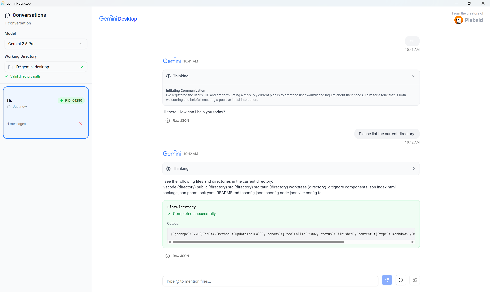

# Gemini Desktop

A powerful, modern desktop UI for Gemini CLI.  Built with Tauri and web technologies.  Cross-platform, open-source on [GitHub.](https://github.com/Piebald-AI/gemini-desktop)

Web version in progress.

> [!WARNING]
> We're working on implementing automatic saving on top of Gemini CLI, but it's ultimately a hack.  It would be more robust to have automatic recording incorporated into the Gemini CLI itself.  We've opened PR [#4401](https://github.com/google-gemini/gemini-cli/pull/4401) on the Gemini CLI repo with a complete implementation; please :+1: it to encourage it to be merged!



## How it works

Gemini CLI can function as an ACP (Agent Communication Protocol) server, which enables real-time communication via JSON RPC 2.0 between the client, Gemini Desktop, and the server, Gemini CLI.

## Building

```
git clone https://github.com/Piebald-AI/gemini-desktop
cd gemini-desktop
pnpm install
pnpm tauri dev
```

## Forking

If you want to contribute to the project, you'll need to fork the repository and set up the remotes correctly. Here's how:

1.  **Fork the repository:** Use the `gh` command-line tool to fork the repository to your own GitHub account.

    ```bash
    gh repo fork Piebald-AI/gemini-desktop --clone=false
    ```

2.  **Update the remotes:** Set the `origin` remote to your newly created fork and add the original repository as the `upstream` remote.

    ```bash
    git remote set-url origin https://github.com/YOUR_USERNAME/gemini-desktop.git
    git remote add upstream https://github.com/Piebald-AI/gemini-desktop.git
    ```

3.  **Verify the remotes:** You can verify that the remotes are set up correctly by running the following command:

    ```bash
    git remote -v
    ```

    You should see something like this:

    ```
    origin  https://github.com/YOUR_USERNAME/gemini-desktop.git (fetch)
    origin  https://github.com/YOUR_USERNAME/gemini-desktop.git (push)
    upstream        https://github.com/Piebald-AI/gemini-desktop.git (fetch)
    upstream        https://github.com/Piebald-AI/gemini-desktop.git (push)
    ```

## Features

- Choose between models (Gemini 2.5 Pro, Gemini 2.5 Flash, Gemini 2.5 Flash-Lite)
- Send messages to/from Gemini and receive responses
- Handle tool call requests
- Markdown support ([#1](https://github.com/Piebald-AI/gemini-desktop/issues/1))

### Planned

- Automatic chat history saving ([#2](https://github.com/Piebald-AI/gemini-desktop/issues/2)).  Note: See related PRs [#4401](https://github.com/google-gemini/gemini-cli/pull/4401) and [#4609](https://github.com/google-gemini/gemini-cli/pull/4609) on the Gemini CLI repo.
- MCP server management
- Token/cost information
- More advanced tool call support

## Contributing

Contributions are welcome, although it's a bit raw still.

## License

[MIT](./LICENSE)

Copyright © 2025 [Piebald LLC.](https://piebald.ai)
